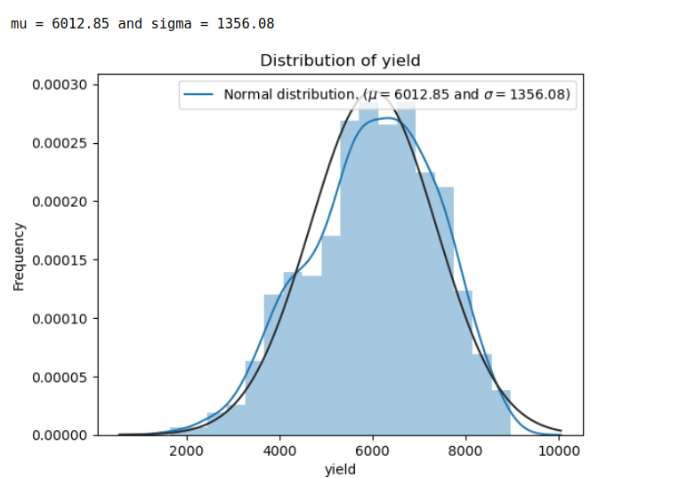
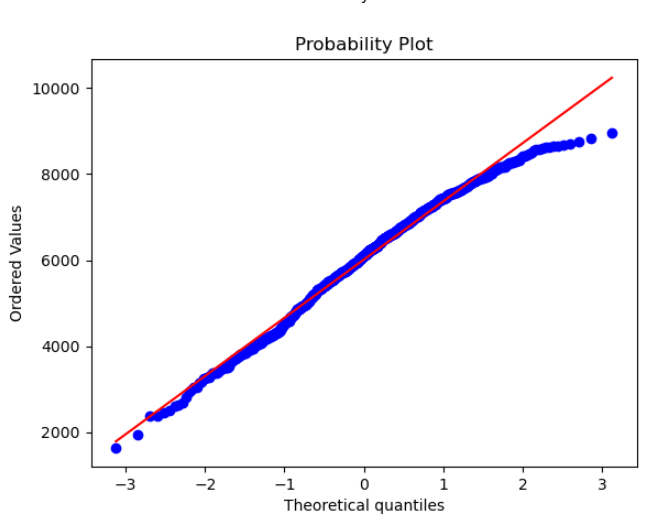
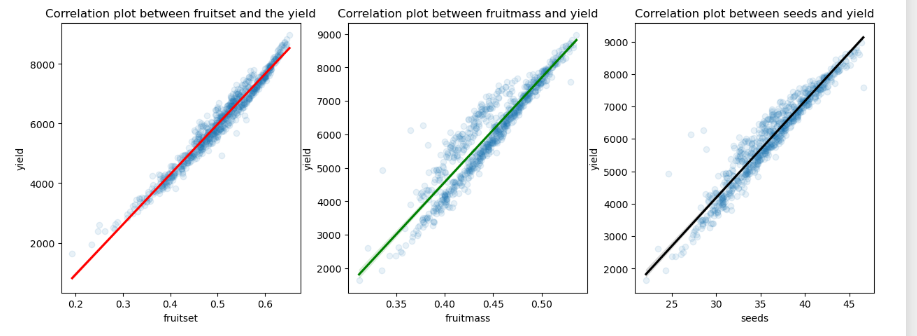
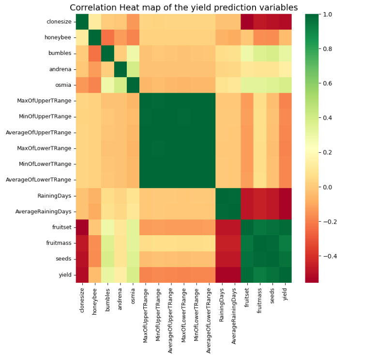

# Wild Blueberry Yield prediction

The dataset used for predictive modeling was generated by the Wild Blueberry Pollination Simulation Model, which is an open-source, spatially-explicit computer simulation program that enables exploration of how various factors, including plant spatial arrangement, outcrossing and self-pollination, bee species compositions and weather conditions, in isolation and combination, affect pollination efficiency and yield of the wild blueberry agroecosystem. 

The simulation model has been validated by the field observation and experimental data collected in Maine USA and Canadian Maritimes during the last 30 years and now is a useful tool for hypothesis testing and theory development for wild blueberry pollination researches.

## The dataset

| Feature   | Unit   | Description | 
|---------- |------- |-------------|
|Clonesize  | $m^2$    | The average blueberry clone size in the field |
| Honeybee  | $bee/m^2/min$| Honey bee density in the field|
| Bumbles   | $bees/m^2/min$ | Bubmble bee density in the field|
| Andrean   | $bee/m^2/min$ | Andrena bee density in the field|
| Osmia     | $bee/m^2/min$ | Osmia bee density in the field |
| MaxOfUpperTRange | $&deg;C$ | The highest record of the upper band daily air temperature during the bloom season |
| MinOfUpperTRange| $&deg;C$ | The lowest record of the upper band daily air temperature | 
| AverageOfUpperTRange| $&deg;C$| The average of the upper daily band daily air temperature | 
| MaxOfLowerTRange | $&deg;C$ | The highest record of the lower band daily air temperature | 
| MinOfLowerTRange | $&deg;C$ | The lowest record of the lower band daily air temperature|
| AverageOfLowerTRange | $&deg;C$ | The average of the lower band daily air temperature |
| RainingDays | $Day$ | The total number of days during the bloom season, each of which has precipitaion larger than zero|
| AverageRainingDays | $Day$ | The average of raining days of the entire bloom season|
| Fruitmass| $Kg$ | **The weight of the fruits from the field** |
| Fruitset| $Nos$ | **the number of fruits per set**| 
| Yield | $Kg$ | **The yield from the field** | 

## Dataset info and description
The dataset contains 13 input features and one target variable, named yield, which represents the yield in kg of a field.

The target variable has a normal distribution, hence there was no need to proceed with a Box-Cox transformation on the variable, as shown in the figures below: 

    

Drilling further down to these three variables, it is okay to assume that they are derivatives of the target variable. For example: 
$Yield$ = $f(fruit_mass, fruit_set, seeds)$

The regression plot below illustrates this further: 

Using a correlation matrix, its clear that the target variable `yield` has a high correlation with the features $Fruitmass$, $Fruitset$ and $Seeds$.

This means that with three features we can already predict the yield, but would be highly biased towards these features, and we would need to eliminate the features before proceeding with model predictions later.
 

## Train data distribution

## EDA (EXploratory Data Analysis)